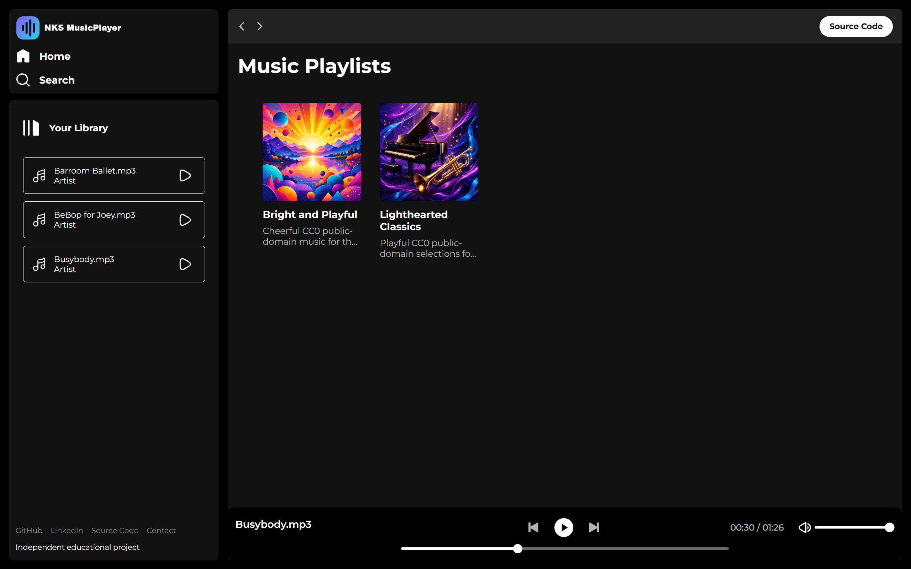

<p align="center">
  
</p>

<h1 align="center">NKS MusicPlayer</h1>

<p align="center">
  A responsive browser-based music player built with HTML, CSS, and vanilla JavaScript.
</p>

## Live Demo

**Production website:**
https://music-player-web-app-three.vercel.app

## Preview

[](https://music-player-web-app-three.vercel.app)

The production version includes two CC0 demo collections:

- **Bright and Playful**
- **Lighthearted Classics**

The player includes six verified CC0 public-domain tracks, custom album artwork, synchronized song-row controls, previous and next navigation, seek preview, saved volume, and saved playback state.
## Overview
NKS MusicPlayer is an independent educational web project that loads locally available album metadata and audio tracks. The interface includes album browsing, a scrollable song library, synchronized play and pause controls, track navigation, seeking, volume control, mute restoration, and responsive navigation.

## Features

- Original NKS MusicPlayer logo and browser favicon
- Responsive album and playlist interface
- Play, pause, previous, and next controls
- Song-row icons synchronized with the main player
- Automatic playback of the next track
- Interactive seek bar with hover preview and time tooltip
- Volume slider with low, medium, full, and mute icons
- Restores the previous volume after unmuting
- Local album metadata and cover artwork
- Responsive sidebar for smaller screens

## Tech Stack

- HTML5
- CSS3
- JavaScript
- Web Audio API through the HTMLAudioElement interface
- JSON album metadata

## Run Locally

1. Clone or download the repository.
2. Open the project folder in Visual Studio Code.
3. Start the project with the VS Code Live Server extension.
4. Open the generated local URL in a browser.

The player requires a local web server because the application loads JSON metadata with `fetch()`.

## Project Structure

```text
Music-Player-Web-App/
├── img/
│   ├── logo.svg
│   ├── logo-full.svg
│   └── player-control icons
├── songs/
│   └── local album folders and metadata
├── albums.json
├── index.html
├── script.js
├── style.css
├── utility.css
└── README.md
```

## Included Demo Audio

The included demo tracks are CC0 1.0 Universal public-domain music. See [`AUDIO-LICENSES.md`](AUDIO-LICENSES.md) for source URLs, hashes, and license details.

## Important Content Note

The repository interface is an independent educational project. Audio files and cover artwork must only be distributed or deployed when the relevant permissions or licenses allow public use.

## Author

**Neeraj Kumar Saini**

- GitHub: [NeerajSaini271](https://github.com/NeerajSaini271)
- LinkedIn: [neerajsaini271](https://www.linkedin.com/in/neerajsaini271)
- Email: [neerajkhetrisaini@gmail.com](mailto:neerajkhetrisaini@gmail.com)
